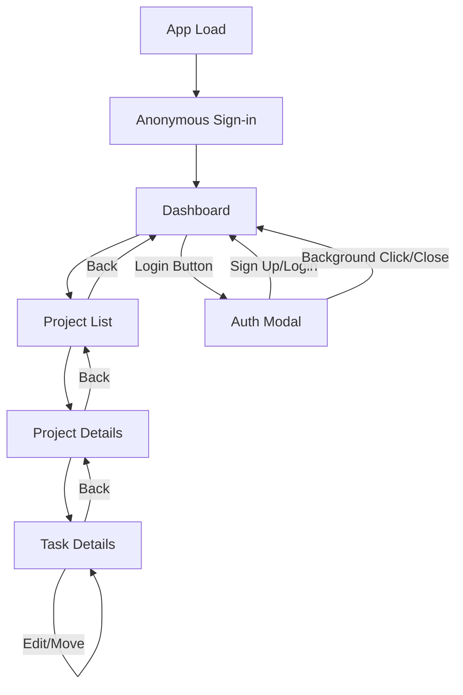

# Only Task Manager – Comprehensive Step-by-Step Plan

## 1. Project Overview and Objectives

- **Goal:** Build a visually engaging, real-time project/task management app for software developers and visually-oriented users, with a unique, game-like UI/UX.
- **Platform Focus:** Optimized for Safari on iOS/macOS, but cross-browser compatible.
- **Core Differentiator:** Highly animated, colorful, and playful interface, breaking away from standard Apple conventions.

---

## 2. Foundational Architecture

### 2.1. Technology Stack

- **Vue.js 3.x (Composition API):** Modern, scalable frontend framework.
- **Pinia:** Preferred state management for modular, maintainable stores.
- **Vue Router:** For SPA navigation with custom animated transitions and auth guards.
- **Firebase SDK:**
  - **Cloud Firestore:** Real-time, cloud-based data storage.
  - **Authentication:** Secure, multi-user support with Anonymous sign-in by default.
- **Animation Libraries:** GSAP and/or @vueuse/motion for advanced, performant animations.
- **Vite:** Fast build tool and dev server.
- **TypeScript:** For type safety and maintainability.

### 2.2. High-Level Architecture Diagram

```mermaid
flowchart TD
    A[User (Safari/iOS/macOS)] -->|UI Interaction| B[Vue 3 App]
    B --> C[Pinia Store]
    B --> D[Vue Router (Animated Transitions)]
    B --> E[GSAP / VueUse/motion (Animations)]
    C --> F[Firebase SDK]
    F --> G[Cloud Firestore]
    F --> H[Firebase Auth]
```

---

## 3. UI/UX Design and Animation Strategy

### 3.1. Visual & Interaction Design

- **Color Palette:** Develop a vibrant, non-standard palette with gradients (inspired by top animated web apps and game UIs). New color palette and gradients defined in `src/assets/main.css`.
- **Component Library:** Build custom, animated components (cards, draggable lists, modals, progress meters). `BaseModal` component (with background click dismissal) and `AuthModal` (repurposed from AuthView) implemented and styled.
- **Layout:** Use playful, non-traditional layouts (e.g., overlapping cards, floating action buttons).
- **Accessibility:** Follow WCAG 2.1 AA and Apple’s Human Interface Guidelines.

### 3.2. Animation

- **Navigation:** Animated route transitions (e.g., slide, fade, 3D flip) using GSAP/VueUse/motion. Basic fade transitions implemented.
- **Feedback:** Micro-interactions for CRUD actions (e.g., confetti on task completion, animated card movement).
- **Performance:** Use requestAnimationFrame, hardware-accelerated CSS, and optimize for Safari/iOS.

### 3.3. Prototyping & Testing

- Prototype unique UI elements and test on iOS/macOS Safari.
- Reference best-in-class animated web apps and game UIs for inspiration.

---

## 4. Core Functionality Implementation

### 4.1. Data Model

- **Project:** id, name, color, createdAt, updatedAt, userId (implemented for authentication)
- **Task:** id, projectId, title, description, status (To Do, Debug, Add Feature, Done), createdAt, updatedAt, userId (implemented for authentication)

### 4.2. CRUD Operations

- **Projects:** Create, read, update, delete (with animated feedback)
- **Tasks:** Create (via modal), read, update, delete, move between statuses (with drag-and-drop and animation)

### 4.3. Real-Time Sync

- Use Firestore listeners for instant updates across devices/sessions.
- Optimistic UI updates for smooth user experience.

### 4.4. Authentication (Implemented with Anonymous Auth)

- **Goal:** Integrate Firebase Auth for multi-user support and data ownership, allowing immediate access via anonymous sign-in.
- **Phased Implementation (Completed Phases 1 & 2):**
  - **Phase 1: Setup & Core Logic:** Environment Variables, Update Firebase Init, Auth Composable (`useAuth.ts` - including anonymous sign-in and fix for recursion), Auth Pinia Store (`authStore.ts` - with anonymous sign-in on load and `authLoadedPromise`).
  - **Phase 2: UI & Routing:** Auth Modal (`AuthModal.vue` - repurposed from AuthView, integrated with BaseModal), Navigation Guard (`router/index.ts` - adjusted to wait for authLoadedPromise and remove /auth route), Update `App.vue` / Layout (integrate AuthModal, conditional navbar display based on `isAnonymous`).
  - **Phase 3: Data Security & Integration (Next Focus):** Firestore Security Rules (update to use `userId`), Update Data Stores (`projectStore`, `taskStore`) to include `userId` and filter queries, Update UI Components to handle authenticated state.
- **Secure Firestore rules** to protect user data based on `userId`.

---

## 5. Navigation and Workflow

### 5.1. Core Views

- **Dashboard:** High-level overview (animated stats, project/task summaries)
- **Project List:** Browse, organize, and manage projects (animated cards)
- **Task Details:** In-depth task management (animated transitions, status updates)
- **Auth Modal:** Login/Signup interface presented in a modal.

### 5.2. User Flows



- All navigation transitions are animated for visual engagement.

### 5.3. Workflow Features

- Drag-and-drop for task status changes (animated)
- Animated feedback for all user actions
- Clear, animated visual cues for project/task lifecycle
- Modal for adding tasks (Implemented and styled).
- Auth modal for login/signup (Implemented and styled, with background click dismissal).

---

## 6. Testing and Optimization

### 6.1. Cross-Browser & Device Testing

- Use BrowserStack to test on Safari (iOS/macOS) and other browsers.
- Use Lighthouse for performance and animation smoothness audits.

### 6.2. Animation Optimization

- Minimize layout thrashing and repaints.
- Use hardware-accelerated CSS and efficient animation libraries.
- Provide motion reduction options for accessibility.

### 6.3. User Feedback

- Gather feedback on visual appeal, usability, and responsiveness.
- Iterate on design and interaction patterns based on feedback.

---

## 7. Deployment and Future Enhancements

### 7.1. CI/CD & Hosting

- Set up CI/CD pipelines (Vercel/Netlify) for automated testing and deployment.
- Use environment variables for Firebase config.

### 7.2. Documentation

- Document codebase, design system, and animation patterns for future expansion.

### 7.3. Post-Launch Enhancements

- Use analytics and user feedback to guide new features and improvements.
- Maintain the unique, animated, and engaging experience as a core differentiator.

---

## References & Best Practices

- Google Search: Animated Vue apps, game UI patterns, Safari/iOS animation performance, Firebase best practices, modern modal design, multi-color palettes, CSS gradients, Firebase Auth best practices, Firestore security rules, Anonymous Firebase Auth
- Apple Human Interface Guidelines (web/animation)
- Top-rated animated web apps for inspiration
